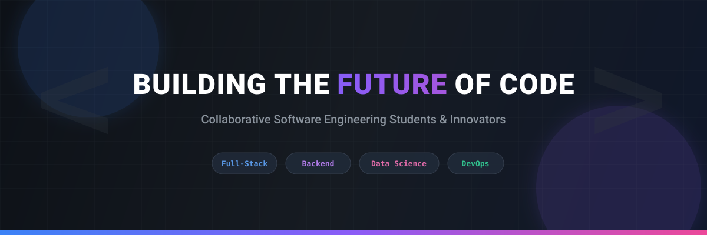

  

<h1 align="center">We turn ambitious ideas into working systems.</h1>

  <strong>Software engineering students · builders · curious minds</strong> 
  We design, ship, test, and learn together.

  
  
  

---

## The Build Loop

  <code>IDEA</code> &nbsp;→&nbsp; <code>PROTOTYPE</code> &nbsp;→&nbsp; <code>FEEDBACK</code> &nbsp;→&nbsp; <code>SHIP</code> &nbsp;↺

We are a close-knit team of software engineering students who treat every project as a chance to make the next one sharper. Our sweet spot is the space where thoughtful architecture meets useful, human software.

| We care about | What that looks like |
| :--- | :--- |
| **Systems that last** | Clear APIs, resilient services, and code that welcomes its next contributor. |
| **Interfaces with intent** | Fast, accessible experiences that make complex work feel simple. |
| **Learning by shipping** | Small experiments, honest feedback, and steady improvement in public. |

---

## 👥 The People Behind The Pull Requests

<table align="center">
  <tr>
    <td align="center" width="20%">
       
      <b>Samuel Girma</b> 
      Backend & Architecture
    </td>
    <td align="center" width="20%">
       
      <b>Zaferan Miftah</b> 
      Full-Stack Development
    </td>
    <td align="center" width="20%">
       
      <b>Hawi Taye</b> 
      Frontend & UI/UX
    </td>
    <td align="center" width="20%">
       
      <b>Hayat Abdulfetah</b> 
      Systems & Logic
    </td>
    <td align="center" width="20%">
       
      <b>Nejat Musa</b> 
      Data & Testing
    </td>
  </tr>
</table>

---

## 🛠️ Our Current Toolkit

| Category | Technologies & Tools |
| :--- | :--- |
| **Languages & Core** | `JavaScript`, `TypeScript`, `Python`, `SQL` |
| **Frontend & UI** | `React`, `Vite`, `Tailwind CSS`, `HTML5/CSS3` |
| **Backend & APIs** | `Node.js`, `Express`, `REST APIs`, `Webhooks` |
| **Databases & Data** | `SQLite`, `PostgreSQL`, `Pandas`, `Data Science Libraries` |
| **DevOps & Workflow** | `Git & GitHub`, `Linux (Ubuntu)`, `Docker`, `Vercel` |

---

   
  <i>"Simplicity is prerequisite for reliability." — Edsger W. Dijkstra</i>  
  <strong>Come build something that earns its place in the world.</strong>

